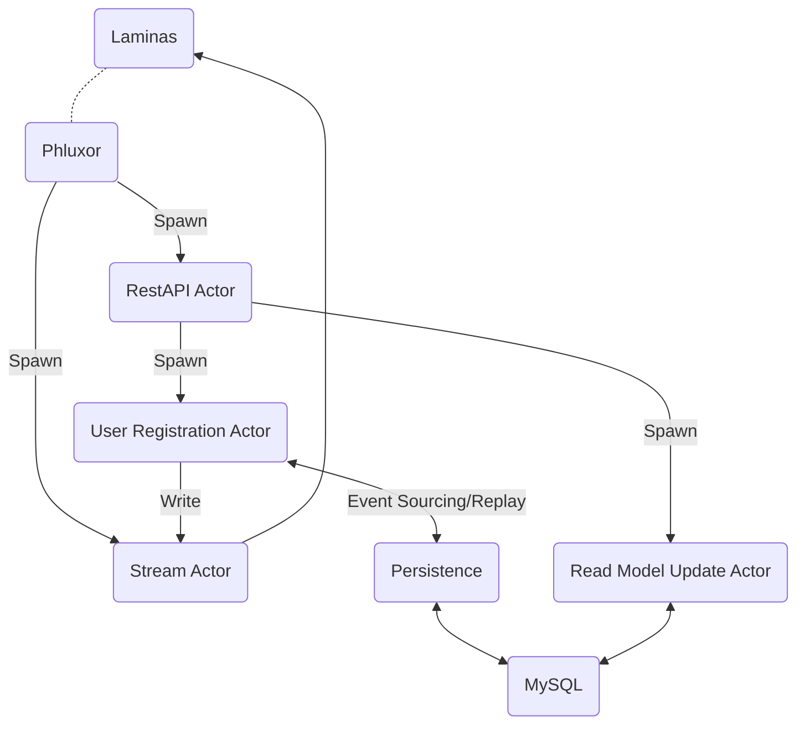
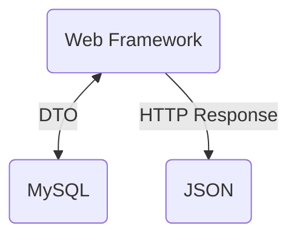

# Phluxor ES CQRS Sample

This is a sample project that demonstrates how to use Phluxor with Event Sourcing and CQRS.

## Architecture

this sample uses MySQL for persistence,  
but uses different tables for Command / Query.  
Read Model updates are processed by the Read Model Update Actor using Event Sourcing replay etc.

CommandとQueryの2つのパターンで実装しています。  
MySQLを使って永続化しています

Read Model更新アクターがQuery用に加工処理しています。

### Command



### Query



## How to run

```bash
$ docker-compose up -d

# boot application command
# $ ./vendor/bin/laminas mezzio:swoole:start -w 1
# kill process running on port 8080
# lsof -P | grep ':8080' | awk '{print $2}' | xargs kill -9
```

## Post a command / create user

In this sample, an actor is generated and persisted for each email address.  
The same actor cannot be generated, so you cannot register with the same email address.

このサンプルではメールアドレスごとにアクターが生成、永続化されます。  
同じアクターは生成できない仕組みにしているため、同じメールアドレスで登録することはできないようになっています。

```bash
$ curl --request POST \
  --url http://127.0.0.1:8080/user/registration \
  --header 'Content-Type: application/json' \
  --data '{
	"username": "test",
	"email": "test@example.com"
}'
```

## Get a query

```bash
$ curl --request GET \
  --url http://127.0.0.1:8080/users 
```

this sample returns hal+json,  
but you can implement it with GraphQL or gRPC etc.  
There are no restrictions on the response format.

このサンプルではjsonを返していますが、  
GraphQLやgRPC、HAL+JSONなどでも実装可能です。  
レスポンスフォーマットには特に制限はありません。

```json
[
  {
    "id": "01J2443CQXV8MGN8CDWR9JJXBF",
    "name": "test",
    "email": "test1@example.com",
    "created_at": "2024-07-06 22:35:25"
  },
  {
    "id": "01J2441Z9TKYWBS9Y0866GRPXG",
    "name": "test",
    "email": "test@example.com",
    "created_at": "2024-07-06 22:34:38"
  }
]
```
